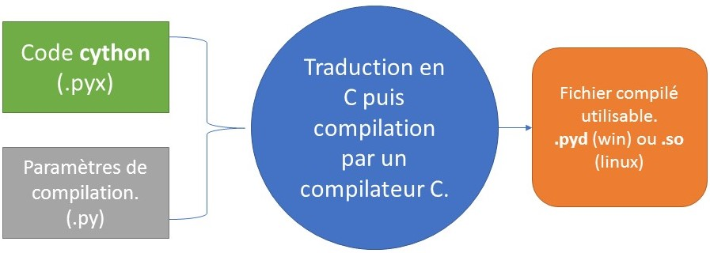
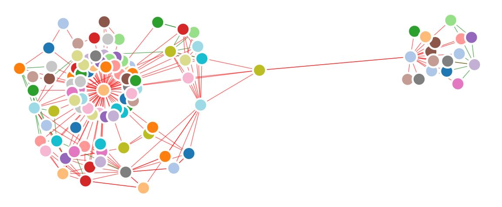
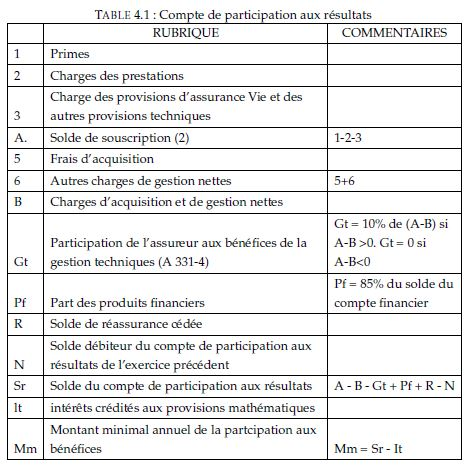
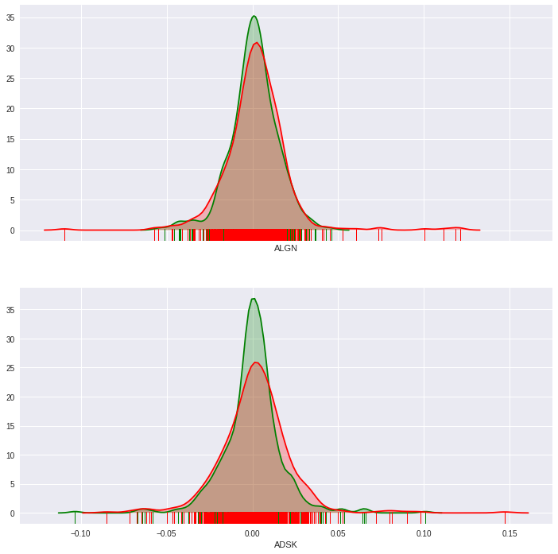

---
title:  DETECTION D'ANOMALIES ET MISSIONS TRANVERSALES
author: BAMOUNI Kevin
theme: moon
progress: true
slideNumber: true
width: 1820
height: 980
margin: 0.1
minScale: 0.1
maxScale: 1
transition: 'convex'
...

# Plan

##    

- MON ALTERNANCE A GROUPAMA GAN VIE

- PYTHON ET C

- SAS à PYTHON

- CALCUL DE PARTICIPATION AU BENEFICE REGLEMENTAIRE

- CHALLENGE R DE GROUPAMA

# MON ALTERNANCE A GROUPAMA GAN VIE

## GROUPAMA GAN VIE

GROUPAMA GAN VIE 1 (GGVie) est la société vie unique du groupe GROUPAMA.
Elle assure la conception, la souscription et la gestion des contrats d’assurances
de personnes (épargne, retraite, prévoyance et santé)

## POSTE ET MISSIONS

Mon alternance s’est déroulé au sein du service de veille réglementaire et technologique
(SVRT) où j'occupais un poste de chargé d'études actuarielles pour la veille technologique.

# PYTHON ET C

## CYTHON

Le langage cython est une extension du langage python qui étend les possibilités
de python, à la déclaration de variable et l’utilisation de fonctions C.

## FONCTIONNEMENT DE CYTHON

# REPORTING SOLVABILITE 2

## REPORTING

Le pilier 3 de solvabilité 2 vise à une standardisation de la publication des informations
financières ayant été utilisées pour les calculs aux deux premiers piliers.

## GRAPHE DES RELATIONS

# SAS à PYTHON

## MISSION : Préparer le passage de SAS à Python

- Comprendre l’ensemble des traitements effectués pour réaliser avec SAS.
- Tester ces traitements sous python tout en les documentant.
- Former le collaborateur en charge de la migration à python.

## Conclusion.

Elle a été bien menée et a permi de comparer les deux concepts des langages SAS et Python.

# CALCUL DE PARTICIPATION AU BENEFICE REGLEMENTAIRE

## MISSION : créer un outil de calcul

Créer un outil dédié au calcul de la participation au bénéfice règlementaire avec python, pour ce défaire des contraintes des classeurs excel.

Le calcul se fait à partir du compte de participation au résultat.

## Conclusion

La création de l'outil n'a pas pu être effective principalement à cause des contraintes de vocabulaire rencontrés.

# CHALLENGE R DE GROUPAMA

La direction internationale du Groupe GROUPAMA a lancé au début de l’année
2017 un concours de data science entre toutes les entités et filiales du groupe,
baptisé le "Challenge R".

## Garbage in, Garbage out (GIGO)
GIGO est un modèle qui détecte les anomalies dans les résultats de modélisation
du passif en se basant sur la forme générale de toute les séries chronologiques.

## Méthode d’isolation des anomalies (Isolation Forest).

La détection d’anomalies, consiste à isoler ces données rares et fortement différentes
d’une base de données. La méthode utilisée procède par isolation des anomalies dans des arbres de décision.

- Phase d'apprentissage : construction des arbres de décision
- Phase d'évaluation : Calcul des scores des individus

## Application sur des données financières.

Considérons l’historique des prix de clôture du marché de l’ensemble des actifs
de l’indice S&P 500 entre le 11 Août 2015 et le 11 Août 2017

## Résultats de la détection

# CONCLUSION

##  

Python a été un véritable compagnon au cours de cette expérience professionnelle.
L’ensemble des missions ont été menées avec lui comme principal outil. Il
se veut être une véritable alternative, souple, puissante et polyvalante, à Microsoft
Excel et SAS.
Dans l'ensemble mon alternance s'est bien déroulé et je me suis attelé à accomplir les missions qui m'ont été confiées.
Bien que j'ai pu rencontrer des difficultés, je considère que cela fait parti de la vie professionnel et de l'expérience.

# MERCI